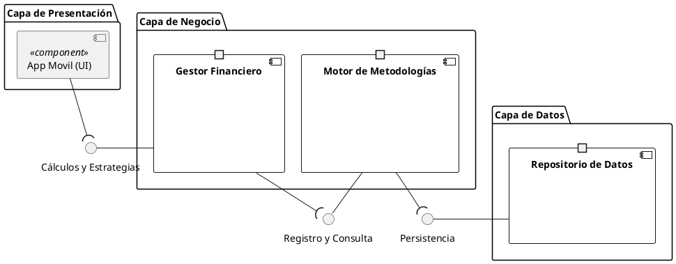
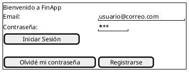
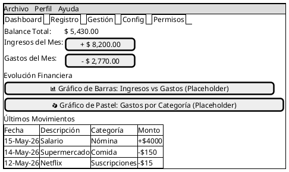
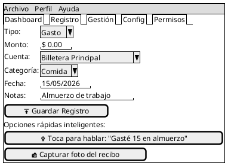
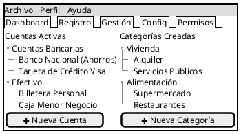
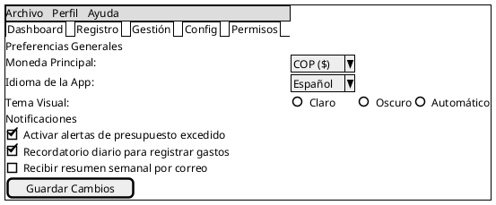
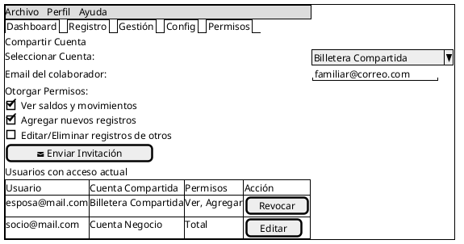

## Diagramas PlantUML

### ¿Qué es PlantUML?

PlantUML es una herramienta de código abierto que permite crear diagramas UML a partir de texto plano usando un lenguaje de marcado sencillo e intuitivo. En el contexto de la arquitectura de software, PlantUML es especialmente valioso porque permite mantener los diagramas versionados junto con el código fuente, facilitando la revisión, la colaboración y la actualización continua de la documentación técnica. Al estar basado en texto, los diagramas de PlantUML se benefician de todas las herramientas del ecosistema de desarrollo: diff, merge, revisión de pull requests y automatización en pipelines de CI/CD.

A diferencia de los diagramas generados por Structurizr (que se derivan directamente del modelo C4 definido en el DSL), los diagramas de PlantUML que se presentan a continuación fueron elaborados de forma independiente para complementar la documentación con perspectivas adicionales sobre la arquitectura del sistema. Mientras que Structurizr se enfoca en mantener la fidelidad entre el modelo y los diagramas, PlantUML ofrece flexibilidad para crear diagramas ad-hoc que exploran aspectos específicos de la arquitectura.

### Diagrama de Componente en PlantUML

El siguiente diagrama de componentes elaborado en PlantUML presenta una vista simplificada de la arquitectura de FinTrack organizada en tres capas clásicas: presentación, negocio y datos. Aunque no sigue exactamente la misma descomposición que los diagramas de componentes de Structurizr (que son más granulares y fieles al modelo C4), este diagrama ofrece una visión complementaria útil para entender la separación de responsabilidades a un nivel arquitectónico más tradicional.

El diagrama utiliza el estilo UML2 con interfaces (bolas y sockets) para representar los contratos entre capas:

* **Capa de Presentación**: Representada por la aplicación móvil (UI), que se comunica con la capa de negocio a través de una interfaz de cálculo y estrategias.
* **Capa de Negocio**: Compuesta por el Gestor Financiero (Core) que orquesta las operaciones principales, y el Motor de Metodologías (Engine) que implementa los algoritmos financieros (cálculo de ahorro, estrategias de pago de deudas, etc.). La comunicación entre estos dos componentes sigue el patrón de interfaz registro y consulta.
* **Capa de Datos**: El Repositorio de Datos (DB) provee persistencia a través de una interfaz de persistencia que el Motor de Metodologías consume.

### Diagrama Wireframe

Los diagramas wireframe son una herramienta fundamental en el diseño de experiencia de usuario (UX). Representan la estructura esquelética de una interfaz sin los detalles visuales (colores, tipografía, imágenes), permitiendo enfocarse en la disposición de los elementos, la jerarquía de la información y los flujos de navegación. En el contexto de FinTrack, los wireframes ayudan a validar que la aplicación sea intuitiva y que los usuarios puedan completar sus tareas financieras sin fricción.

A continuación se presentan las pantallas principales de FinTrack modeladas como wireframes en PlantUML Salt:

#### Inicio de Sesión

Pantalla de entrada a la aplicación con formulario de email y contraseña, enlace para recuperación de contraseña y opción de registro para nuevos usuarios.

#### Dashboard / Resumen Financiero

Pantalla principal que muestra el balance total, los ingresos y gastos del mes, gráficos de evolución financiera y los últimos movimientos registrados.

#### Panel de Registro de Transacciones

Pantalla para registrar una nueva transacción financiera, con opciones rápidas inteligentes como registro por voz y captura de factura con la cámara.

#### Cuentas y Categorías

Pantalla de gestión donde el usuario puede administrar sus cuentas (bancarias, efectivo, tarjetas) y categorías de gasto de forma jerárquica.

#### Configuración

Pantalla de preferencias donde el usuario configura la moneda principal, el idioma, el tema visual y las notificaciones.

#### Permisos y Colaboradores

Pantalla para compartir cuentas financieras con otros usuarios, asignar permisos específicos y gestionar colaboradores existentes.

